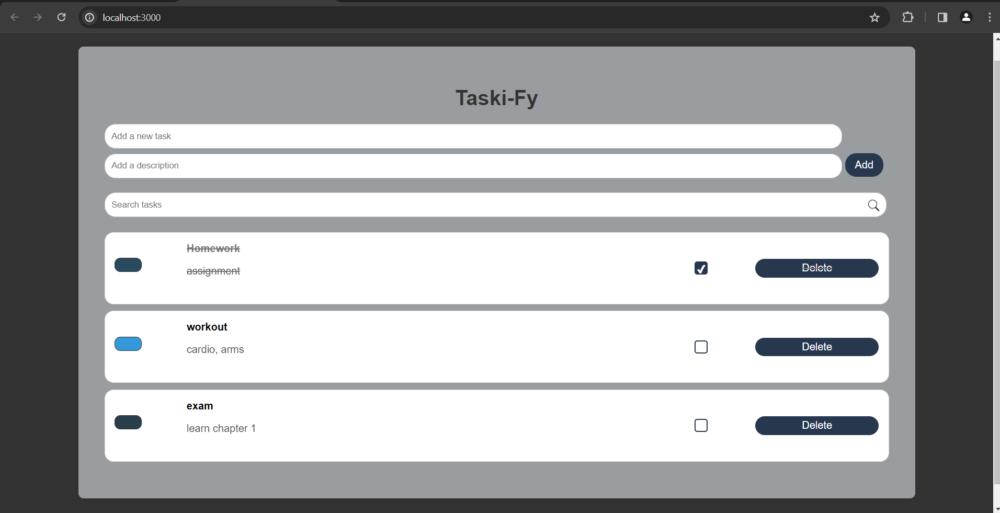

# Taski-Fy

Taski-Fy is a simple task management application built with React.

## Demo



## Features

- **Task Management:** Add, delete, and mark tasks as complete or incomplete.
- **Task Description:** Include descriptions for tasks.
- **Color Coding:** Assign different colors to tasks for better organization.
- **Search:** Use the search bar to filter tasks based on their names.
- **Responsive Design:** Optimized for various screen sizes, including smartphones and tablets.

## Getting Started

### Prerequisites

- Node.js and npm should be installed on your machine.

### Installation

1. Clone the repository.
   ```bash
   git clone https://github.com/your-username/your-project.git
   ```


2. Install dependencies.
    ```bash
    cd taskify
    npm install
    ```

3. Run the application.
    ```bash
    npm start
    ```

### Usage
1. Enter a new task in the "Add a new task" input field.
2. Optionally, provide a description for the task in the "Add a description" input field.
3. Click the "Add" button to add the task to the list.
4. Use the checkboxes to mark tasks as complete or incomplete.
5. Click the color box next to each task to change its color.
6. Delete tasks using the "Delete" button.
7. Use the search bar to filter tasks based on their names.

### Built With
1. [React](https://react.dev/) 
2. [HTML](https://en.wikipedia.org/wiki/HTML)
3. [CSS](https://developer.mozilla.org/en-US/docs/Web/CSS)

"# Taski-Fy" 
